# End-to-End CI/CD Pipeline on AWS Using ECS Fargate, CodePipeline, CodeBuild, and CodeDeploy

---

## Table of Contents

1. [Project Overview](#1-project-overview)
2. [Project Architecture](#2-project-architecture)
3. [Technologies Used](#3-technologies-used)
4. [Repository Structure](#4-repository-structure)
5. [Application Containerization](#5-application-containerization)
6. [AWS Infrastructure Setup](#6-aws-infrastructure-setup)
7. [CI/CD Pipeline](#7-cicd-pipeline)
8. [Build Process](#8-build-process)
9. [Blue/Green Deployment](#9-bluegreen-deployment)
10. [Deployment Artifacts](#10-deployment-artifacts)
11. [Monitoring and Governance](#11-monitoring-and-governance)
12. [Challenges Encountered](#12-challenges-encountered)
13. [Testing](#13-testing)
14. [Lessons Learned](#14-lessons-learned)
15. [Future Improvements](#15-future-improvements)
16. [References](#16-references)

---

## 1. Project Overview

### What This Project Is

This project implements a fully automated, end-to-end CI/CD pipeline on Amazon Web Services. The pipeline takes application source code from a GitHub repository, builds and tests it inside AWS CodeBuild, packages it as a Docker container image, pushes that image to Amazon ECR, and then deploys it to an Amazon ECS Fargate cluster using a Blue/Green deployment strategy orchestrated by AWS CodeDeploy. The deployed application is exposed to the internet through an Application Load Balancer.

The application itself is a Node.js Express web server that serves an HTML status page, a JSON health check endpoint, and an API information endpoint. It is fully containerised and stateless, making it a suitable workload for ECS Fargate.

### What Problem It Solves

In teams that deploy software manually, every release is an operational risk. Developers push code to a repository and someone must log into a server, pull the new version, restart services, verify health, and roll back if something breaks. This process is slow, error-prone, inconsistent across environments, and does not scale.

This project eliminates every manual step between a code commit and a production deployment. When a developer pushes to the GitHub repository:

- The pipeline triggers automatically.
- The application is compiled, tested, and packaged without human intervention.
- A human approver reviews the build before it reaches production.
- CodeDeploy shifts traffic to the new version with zero downtime.
- CloudWatch monitors the deployment in real time.
- If a health check fails, the deployment rolls back automatically without any manual action.

The result is a repeatable, auditable, and reliable deployment process.

### Why CI/CD Matters

Continuous Integration ensures that every code change is automatically validated against the test suite before it is merged or promoted. Continuous Deployment ensures that validated changes reach the target environment through a consistent, automated process. Together they reduce time-to-production, reduce human error, provide a clear audit trail of what was deployed and when, and enable rapid recovery when something goes wrong.

Without CI/CD, a project of this complexity would require a manual runbook of dozens of steps that must be executed in a precise order every time a change is made. This project replaces that runbook with a pipeline that is defined in code and is itself version-controlled.

### Why Blue/Green Deployment Was Chosen

Blue/Green deployment runs two identical environments in parallel. The current production environment (Blue) continues to serve live traffic while the new version (Green) is staged, validated, and warmed up. Traffic is then shifted from Blue to Green in a controlled manner. If anything goes wrong during or after the shift, traffic can be returned to the original Blue environment immediately.

The alternative, a Rolling Update, replaces instances in place one at a time. During the rollout, both old and new versions of the application are simultaneously serving production traffic. This makes debugging harder, increases risk for stateful operations, and complicates rollback because partially-updated clusters must be rolled forward or backward version by version.

Blue/Green was selected for this project because:

- It provides the ability to test the new version behind the ALB test listener before production traffic reaches it.
- Rollback is immediate — traffic is simply redirected back to the original task set.
- It eliminates in-place version mixing during the deployment window.
- It aligns with the project goal of demonstrating production-grade deployment practices.

### Objective of the Capstone

The objective of this capstone project is to design, implement, troubleshoot, and document a production-representative CI/CD system on AWS from scratch. This includes provisioning all supporting infrastructure, wiring together multiple AWS services, resolving real configuration errors encountered during implementation, and validating the complete pipeline through both successful deployments and intentional failure scenarios.

---

## 2. Project Architecture

### Architecture Diagram

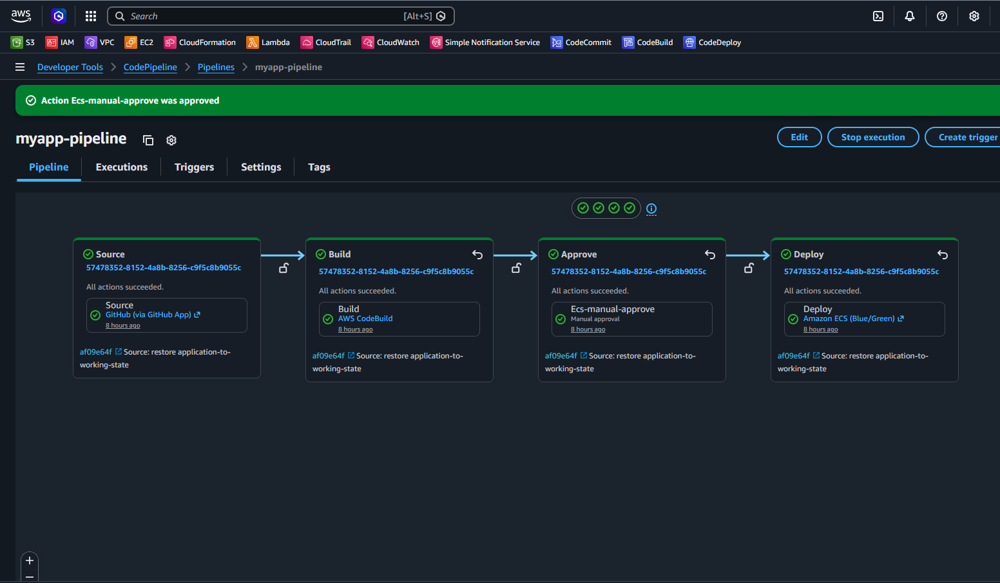

### Architecture Flow

The system is composed of the following services, connected in sequence:

```
GitHub (Source Repository)
        |
        | Push / Merge to main branch
        v
AWS CodePipeline (Orchestrator)
        |
        | Stage 1: Source
        v
AWS CodePipeline Source Action
(Pulls repository into pipeline artifact store — Amazon S3)
        |
        | Stage 2: Build
        v
AWS CodeBuild
(Installs dependencies, runs Jest tests,
 builds Docker image, pushes to ECR,
 generates imageDetail.json artifact)
        |
        | Stage 3: Manual Approval
        v
Amazon SNS (Email Notification to Approver)
        |
        | Reviewer approves or rejects in CodePipeline console
        v
        | Stage 4: Deploy
        v
AWS CodeDeploy
(Blue/Green deployment to ECS Fargate)
        |
        +----> Creates new (Green) ECS Task Set
        |
        +----> Registers Green tasks with Test Target Group
        |
        +----> Test Listener (port 8080) routes to Green tasks
        |
        +----> Shifts production traffic from Blue to Green
               via ALB Production Listener (port 80)
        |
        v
Amazon ECS Fargate
(Runs containerised Node.js application)
        |
        v
Application Load Balancer
(Distributes traffic across ECS tasks)
        |
        v
CloudWatch Alarms
(Monitors ECS task health and ALB metrics)
        |
        | On alarm
        v
SNS Topic
(Email alert to operator)
        |
        | If alarm fires during deployment window
        v
CodeDeploy Automatic Rollback
(Reverts traffic to original Blue task set)
```

### Component Responsibilities

**GitHub**
Hosts the application source code and all pipeline configuration files (buildspec.yml, appspec.yml, taskdef.json, Dockerfile). Acts as the single source of truth. A push to the main branch is the only action required to trigger the entire pipeline.

**AWS CodePipeline**
The top-level orchestrator. Defines the stages of the pipeline, manages the flow of artifacts between stages, stores those artifacts in an S3 bucket, and tracks the overall state of each pipeline execution. CodePipeline does not perform builds or deployments itself; it delegates to CodeBuild and CodeDeploy.

**AWS CodeBuild**
The build environment. Reads instructions from buildspec.yml, spins up a managed build container, executes the build commands, and produces the output artifacts that the deploy stage consumes. In this project, CodeBuild performs: ECR authentication, dependency installation, unit test execution, Docker image construction, Docker image push, and imageDetail.json generation.

**Amazon ECR (Elastic Container Registry)**
The private Docker image registry. Stores all versioned Docker images produced by CodeBuild. Each image is tagged with both a short git commit hash (first 7 characters of `CODEBUILD_RESOLVED_SOURCE_VERSION`) and the `latest` tag. The ECR repository URI is referenced by the ECS Task Definition.

**Manual Approval Stage**
A human gate between the build and deploy stages. When the build stage succeeds, CodePipeline publishes an approval notification via SNS. A designated approver must log in to the AWS Console and either approve or reject the deployment. This prevents untested or unreviewed builds from reaching production automatically.

**AWS CodeDeploy**
Manages the Blue/Green deployment to ECS. Reads the appspec.yml and taskdef.json from the pipeline artifact store, registers a new Task Definition revision, creates a replacement (Green) task set in the ECS service, waits for tasks to become healthy, shifts ALB traffic, and handles rollback if alarms fire.

**Amazon ECS Fargate**
Runs the containerised application. Fargate is the serverless compute engine for ECS, which means there are no EC2 instances to manage. The Task Definition specifies the container image, CPU/memory allocation, networking mode, IAM execution role, and CloudWatch log configuration. Fargate launches tasks into private subnets and handles container scheduling, placement, and restart on failure.

**Application Load Balancer (ALB)**
Routes HTTP traffic to ECS tasks. Configured with two listeners: a production listener on port 80 pointing to the Blue target group, and a test listener on port 8080 pointing to the Green target group during deployment. CodeDeploy uses the ALB to perform traffic shifting between target groups.

**Amazon CloudWatch**
Monitors the health of the deployment. A CloudWatch alarm is configured to watch a metric relevant to application health. If the alarm enters the ALARM state during a CodeDeploy deployment, CodeDeploy automatically rolls the deployment back to the previous (Blue) task set.

**Amazon SNS**
Delivers email notifications at two points: when the manual approval gate opens (notifying the approver that a deployment is pending), and when a CloudWatch alarm fires (notifying the operations team that something has gone wrong).

**Automatic Rollback**
CodeDeploy is configured to roll back automatically when the associated CloudWatch alarm enters ALARM state. The rollback shifts production traffic back to the original (Blue) task set and terminates the replacement (Green) task set.

---

## 3. Technologies Used

| Category           | Technology                | Version / Details                                                                               |
| ------------------ | ------------------------- | ----------------------------------------------------------------------------------------------- |
| Runtime            | Node.js                   | 22 (Alpine base image)                                                                          |
| Web Framework      | Express                   | 5.x                                                                                             |
| Test Framework     | Jest                      | 30.x                                                                                            |
| HTTP Test Client   | Supertest                 | 7.x                                                                                             |
| Containerisation   | Docker                    | Public ECR Node 22 Alpine                                                                       |
| Source Control     | Git                       | —                                                                                               |
| Source Hosting     | GitHub                    | Main branch trigger                                                                             |
| Container Registry | Amazon ECR                | Private repository                                                                              |
| Compute            | Amazon ECS Fargate        | Serverless container runtime                                                                    |
| Task Definition    | ECS Task Definition       | awsvpc network mode, 512 CPU, 1024 MB                                                           |
| Load Balancer      | Application Load Balancer | HTTP port 80 (prod) + port 8080 (test)                                                          |
| Pipeline           | AWS CodePipeline          | 4-stage pipeline                                                                                |
| Build              | AWS CodeBuild             | buildspec.yml v0.2                                                                              |
| Deployment         | AWS CodeDeploy            | Blue/Green ECS deployment                                                                       |
| Monitoring         | Amazon CloudWatch         | Alarms and log groups                                                                           |
| Notifications      | Amazon SNS                | Email subscriptions                                                                             |
| Security           | AWS IAM                   | Task execution role, CodeDeploy service role, CodePipeline service role, CodeBuild service role |
| CLI                | AWS CLI                   | Used for ECR authentication in buildspec                                                        |
| Package Manager    | npm                       | Installed via npm ci                                                                            |

---

## 4. Repository Structure

```
Capstone-Project-2-End-to-End-CI-CD-on-AWS/
|
|-- Dockerfile              # Container build instructions
|-- buildspec.yml           # CodeBuild pipeline instructions
|-- appspec.yml             # CodeDeploy deployment specification
|-- taskdef.json            # ECS Task Definition template
|-- package.json            # Node.js project manifest and scripts
|-- package-lock.json       # Locked dependency tree
|-- .gitignore              # Files excluded from version control
|-- .dockerignore           # Files excluded from Docker build context
|-- README.md               # Project documentation
|
|-- src/
|   |-- server.js           # HTTP server entry point
|   |-- app.js              # Express application and route definitions
|
|-- tests/
    |-- app.test.js         # Jest unit tests for all application routes
```

### File Explanations

**Dockerfile**
Defines the steps to build the production Docker image. Uses the official Node.js 22 Alpine image from the Public ECR gallery as the base. Sets `/app` as the working directory, copies the package manifest first to leverage Docker layer caching, runs `npm ci` for a clean dependency install, copies the remaining source files, exposes port 3000, and sets the container start command to `npm start`.

**buildspec.yml**
The instruction set for AWS CodeBuild. Divided into three phases: `pre_build` (ECR authentication and environment variable setup), `build` (dependency installation, test execution, Docker image construction and tagging), and `post_build` (Docker push to ECR, generation of the `imageDetail.json` artifact). Lists the artifact files that CodePipeline passes to the CodeDeploy stage.

**appspec.yml**
The deployment specification consumed by AWS CodeDeploy. Tells CodeDeploy which ECS service to update, which Task Definition to use (supplied at deploy time via the `<TASK_DEFINITION>` placeholder), and which container and port the ALB should route traffic to.

**taskdef.json**
The ECS Task Definition template. Contains all container configuration including the container name, image reference (supplied at deploy time via the `<IMAGE1_NAME>` placeholder), port mappings, CPU and memory allocation, network mode, execution role, and CloudWatch log configuration. CodeDeploy reads this file and registers a new Task Definition revision with the actual image URI before creating the replacement task set.

**package.json**
The Node.js project manifest. Defines the application name (`myapp`), version, entry point (`src/server.js`), npm scripts (`start`, `dev`, `test`), production dependencies (Express), and development dependencies (Jest, Supertest).

**src/server.js**
The entry point for the Node.js application. Imports the Express app from `app.js`, reads the `PORT` environment variable (defaulting to 3000), and starts the HTTP listener.

**src/app.js**
Defines the Express application and all HTTP routes. Implements three endpoints: `GET /` (HTML landing page with deployment status), `GET /health` (JSON health check returning `{"status":"OK","message":"Application is healthy"}`), and `GET /api/info` (JSON metadata about the application). A catch-all handler returns HTTP 404 for any unrecognised routes.

**tests/app.test.js**
Contains the Jest test suite using Supertest for HTTP-level testing. Three test cases cover the landing page (HTTP 200 with expected content), the health check endpoint (HTTP 200 with expected JSON body), and an unknown route (HTTP 404 with expected error body).

**.gitignore**
Excludes `node_modules/`, `coverage/`, `.env`, and `.DS_Store` from version control.

**.dockerignore**
Excludes `node_modules`, `.git`, `.gitignore`, and `README.md` from the Docker build context, keeping the image lean and preventing local dependency trees from being copied into the container.

---

## 5. Application Containerization

### Why Docker Was Used

ECS Fargate requires container images. Docker provides a consistent, reproducible packaging format that captures the application, its dependencies, and its runtime environment in a single immutable artefact. The same Docker image that passes tests in CodeBuild is the exact image that runs in production, eliminating the "works on my machine" class of bugs.

### The Application

The application is a Node.js Express server with three HTTP endpoints. It has no database, no persistent state, and no external dependencies at runtime beyond the Express framework itself. This makes it an ideal stateless workload for Fargate.

The three endpoints are:

- `GET /` — Returns an HTML page confirming the deployment status with a list of all AWS services in the pipeline.
- `GET /health` — Returns `{"status":"OK","message":"Application is healthy"}` with HTTP 200. This endpoint is used by the ALB target group health checks.
- `GET /api/info` — Returns application metadata as JSON.

### Dockerfile

```dockerfile
FROM public.ecr.aws/docker/library/node:22-alpine

WORKDIR /app

COPY package*.json ./

RUN npm ci

COPY . .

EXPOSE 3000

CMD ["npm", "start"]
```

**Base image:** `public.ecr.aws/docker/library/node:22-alpine` — The official Node.js 22 image from the AWS Public ECR mirror, using the Alpine Linux variant for a minimal image footprint. Using the Public ECR mirror avoids Docker Hub rate limits inside AWS CodeBuild.

**WORKDIR /app** — Sets the working directory inside the container. All subsequent file operations are relative to this path.

**COPY package\*.json ./** — Copies only the package manifest files first. Docker caches each layer. Because dependencies change less frequently than source code, this pattern means `npm ci` only re-runs when the package files actually change, significantly speeding up iterative builds.

**RUN npm ci** — Installs dependencies exactly as specified in `package-lock.json`. The `ci` command (versus `install`) is designed for automated environments: it deletes `node_modules` first, installs from the lock file, and fails if the lock file is out of sync with `package.json`. This ensures reproducibility.

**COPY . .** — Copies the remaining source files into the container after dependencies are installed. The `.dockerignore` file ensures `node_modules` and `.git` are excluded.

**EXPOSE 3000** — Documents that the container listens on port 3000. This is informational metadata; actual port binding is configured in the ECS Task Definition.

**CMD ["npm", "start"]** — The default command executed when the container starts. Runs `node src/server.js` via the `start` script in `package.json`.

### Docker Build and Push to ECR

The Docker build and push are performed inside AWS CodeBuild as part of the pipeline. The steps are defined in `buildspec.yml`:

1. Authenticate Docker to the ECR registry using `aws ecr get-login-password` piped to `docker login`.
2. Build the image with `docker build -t $REPOSITORY_URI:$IMAGE_TAG .`
3. Tag the image with both the commit-specific tag and `latest`.
4. Push both tags to ECR with `docker push`.

The image tag is derived from the first 7 characters of `CODEBUILD_RESOLVED_SOURCE_VERSION`, which is the full git commit SHA of the source revision that triggered the build. This provides traceability between every ECR image and its originating commit.

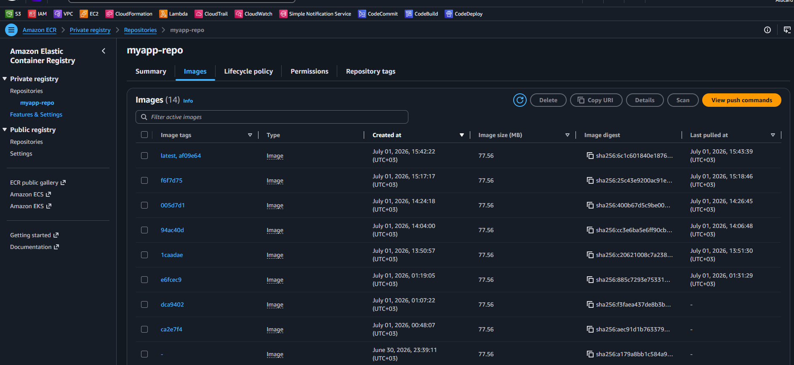

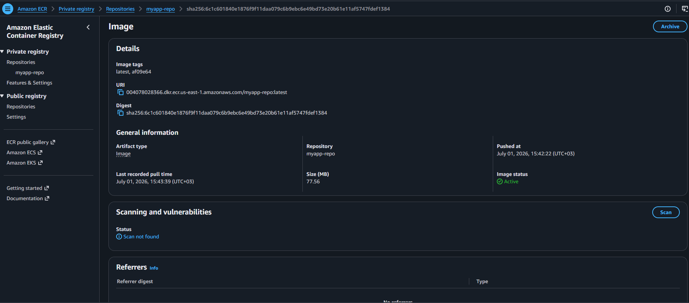

---

## 6. AWS Infrastructure Setup

All infrastructure described in this section was created manually through the AWS Management Console and AWS CLI. The resources are in the `us-east-1` region.

### 6.1 Amazon ECR Repository

An ECR private repository was created to store Docker images produced by CodeBuild.

- **Repository name:** `myapp-repo`
- **URI format:** `004078028366.dkr.ecr.us-east-1.amazonaws.com/myapp-repo`
- **Image tag mutability:** Mutable (to allow the `latest` tag to be overwritten)
- **Scan on push:** `Enabled`

The repository URI is passed to CodeBuild via the `IMAGE_REPO_NAME` environment variable defined in the CodeBuild project configuration.

### 6.2 ECS Cluster

An ECS cluster was created to host the Fargate tasks.

- **Cluster name:** `---`
- **Infrastructure type:** AWS Fargate (serverless, no EC2 instances)
- **Region:** us-east-1


### 6.3 Task Definition

The ECS Task Definition defines the container specification for the application. The Task Definition stored in the repository (`taskdef.json`) serves as the template. CodeDeploy registers a new revision of this Task Definition at deploy time, substituting the `<IMAGE1_NAME>` placeholder with the actual ECR image URI from the build artifact.

Key configuration values from `taskdef.json`:

| Field             | Value                                                                                 |
| ----------------- | ------------------------------------------------------------------------------------- |
| Family            | `myapp-task`                                                                          |
| Network mode      | `awsvpc`                                                                              |
| Launch type       | `FARGATE`                                                                             |
| CPU               | `512` (0.5 vCPU)                                                                      |
| Memory            | `1024` MB                                                                             |
| Container name    | `myapp-container`                                                                     |
| Container port    | `3000`                                                                                |
| Host port         | `3000`                                                                                |
| Protocol          | `tcp`                                                                                 |
| Log driver        | `awslogs`                                                                             |
| Log group         | `/ecs/myapp-task`                                                                     |
| Log region        | `us-east-1`                                                                           |
| Log stream prefix | `ecs`                                                                                 |
| Create log group  | `true`                                                                                |
| Execution role    | `arn:aws:iam::004078028366:role/capstone-ecs-stack-ECSTaskExecutionRole-1ORVgUgrzGIb` |

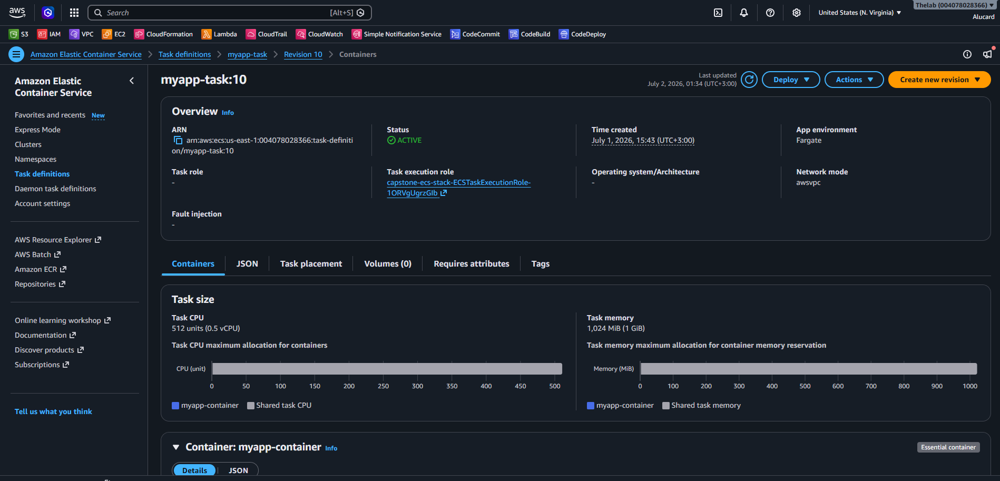

### 6.4 IAM Roles

Several IAM roles are required. Each role grants a specific AWS service the permissions it needs to operate on behalf of the pipeline.

#### ECS Task Execution Role

**Name:** `capstone-ecs-stack-ECSTaskExecutionRole-1ORVgUgrzGIb`

**Purpose:** Used by the ECS container agent to pull the Docker image from ECR and send container logs to CloudWatch Logs.

**Attached policies:** `AmazonECSTaskExecutionRolePolicy` (managed policy) plus permissions for `logs:CreateLogGroup` and `logs:CreateLogStream`.

**Trust relationship:** `ecs-tasks.amazonaws.com`

#### CodePipeline Service Role

**Purpose:** Allows CodePipeline to read from GitHub (via CodeStar Connection or OAuth), write build artifacts to S3, invoke CodeBuild projects, invoke CodeDeploy, and publish SNS approval notifications.

**Trust relationship:** `codepipeline.amazonaws.com`

#### CodeBuild Service Role

**Purpose:** Allows CodeBuild to read source artifacts from S3, write build logs to CloudWatch Logs, authenticate with ECR (`ecr:GetAuthorizationToken`, `ecr:BatchCheckLayerAvailability`, `ecr:PutImage`, `ecr:InitiateLayerUpload`, `ecr:UploadLayerPart`, `ecr:CompleteLayerUpload`), and write output artifacts back to S3.

**Trust relationship:** `codebuild.amazonaws.com`

#### CodeDeploy Service Role

**Purpose:** Allows CodeDeploy to manage ECS services, register Task Definitions, modify ALB target group rules, and describe ECS tasks during the deployment process. Required permissions include `ecs:DescribeServices`, `ecs:CreateTaskSet`, `ecs:UpdateServicePrimaryTaskSet`, `ecs:DeleteTaskSet`, `ecs:RegisterTaskDefinition`, `iam:PassRole`, `elasticloadbalancing:DescribeTargetGroups`, `elasticloadbalancing:ModifyListener`, and `elasticloadbalancing:DescribeListeners`.

**Trust relationship:** `codedeploy.amazonaws.com`

### 6.5 Application Load Balancer

The ALB routes external HTTP traffic to ECS tasks. It is configured with two listeners to support Blue/Green deployments.

- **Type:** Application Load Balancer
- **Scheme:** Internet-facing
- **Subnets:** `---`
- **Security group:** `---` — allows inbound TCP on port 80 (production) and port 8080 (test) from the internet (0.0.0.0/0)

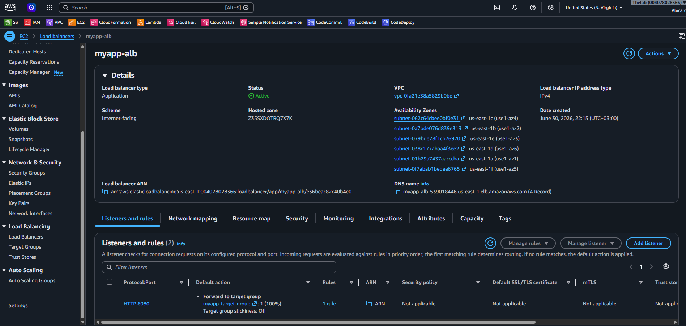

#### Production Listener

- **Port:** 80
- **Protocol:** HTTP
- **Default action:** Forward to Blue target group
- **During deployment:** CodeDeploy modifies this listener to shift traffic to the Green target group

#### Test Listener

- **Port:** 8080
- **Protocol:** HTTP
- **Default action:** Forward to Green target group
- **Purpose:** Allows manual validation of the new (Green) version before production traffic is shifted

### 6.6 Target Groups

Two target groups are required for Blue/Green deployments. CodeDeploy shifts traffic between them.

#### Blue Target Group (Original)

- **Name:** `my-target-group`
- **Target type:** IP (required for Fargate awsvpc network mode)
- **Protocol:** HTTP
- **Port:** 3000
- **Health check path:** `/health`
- **Health check protocol:** HTTP

#### Green Target Group (Replacement)

- **Name:** `myapp-green-target-group`
- **Target type:** IP
- **Protocol:** HTTP
- **Port:** 3000
- **Health check path:** `/health`
- **Health check protocol:** HTTP

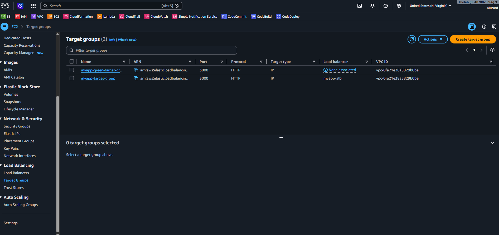

### 6.7 Security Groups

Two security groups were configured:

**ALB Security Group**
Allows inbound HTTP on ports 80 and 8080 from the internet. Allows all outbound traffic to the ECS task security group.

**ECS Task Security Group**
Allows inbound traffic on port 3000 exclusively from the ALB security group. This restricts direct internet access to the containers; all traffic must pass through the ALB. Allows all outbound traffic (for ECR image pulls, CloudWatch log delivery, and SSM if needed).

### 6.8 ECS Service

The ECS Service maintains the desired number of running tasks and integrates with the ALB. A critical configuration detail: the ECS Service **must** be created with the deployment controller type set to `CODE_DEPLOY`. If the service is created with the default `ECS` rolling update controller, CodeDeploy cannot manage it and the pipeline will fail.

- **Service name:** `---`
- **Cluster:** `---`
- **Launch type:** FARGATE
- **Deployment controller:** `CODE_DEPLOY`
- **Task definition:** `myapp-task`
- **Desired count:** `---`
- **Load balancer:** Associated with the ALB production listener and the Blue target group
- **Subnets:** `---`
- **Security group:** ECS Task security group
- **Assign public IP:** `---`

### 6.9 CodeDeploy Application and Deployment Group

CodeDeploy must be configured with an Application and a Deployment Group before CodePipeline can use it.

#### CodeDeploy Application

- **Application name:** `---`
- **Compute platform:** Amazon ECS

#### CodeDeploy Deployment Group

- **Deployment group name:** `myapp-deplyment-group`
- **Service role:** CodeDeploy service role ARN
- **Deployment type:** Blue/Green
- **ECS cluster:** `---`
- **ECS service:** `---`
- **Load balancer:** The ALB configured above
- **Production listener:** Port 80
- **Test listener:** Port 8080
- **Blue target group:** `---`
- **Green target group:** `---`
- **Traffic rerouting:** `automatic `
- **Termination of original task set:** `5 minutes changed from 1 hour` after successful deployment
- **Rollback:** Enabled when CloudWatch alarm fires

---

## 7. CI/CD Pipeline

The pipeline has four stages: Source, Build, Approval, and Deploy.


### Stage 1: Source

| Property        | Value                                     |
| --------------- | ----------------------------------------- |
| Stage name      | Source                                    |
| Action provider | GitHub (via CodeStar Connection or OAuth) |
| Repository      | `---`                                     |
| Branch          | `main`                                    |
| Output artifact | `SourceArtifact`                          |
| Detection mode  | Webhook (triggers on push to main)        |

**Purpose:** Monitors the GitHub repository for changes. When a commit is pushed to the `main` branch, CodePipeline downloads the repository contents and stores them as the `SourceArtifact` in the pipeline S3 bucket.

**Expected result:** On every push to main, a new pipeline execution begins automatically within seconds.

### Stage 2: Build

| Property              | Value                                                     |
| --------------------- | --------------------------------------------------------- |
| Stage name            | Build                                                     |
| Action provider       | AWS CodeBuild                                             |
| Input artifact        | `SourceArtifact`                                          |
| Output artifact       | `BuildArtifact`                                           |
| Build project         | `---`                                                     |
| Environment variables | `AWS_ACCOUNT_ID`, `AWS_DEFAULT_REGION`, `IMAGE_REPO_NAME` |

**Purpose:** Executes the instructions in `buildspec.yml`. Installs Node.js dependencies, runs the Jest test suite, builds the Docker image, pushes it to ECR, and produces the deployment artifacts (`imageDetail.json`, `appspec.yml`, `taskdef.json`).

**Input:** `SourceArtifact` (the repository content)

**Output:** `BuildArtifact` (a ZIP containing `imageDetail.json`, `appspec.yml`, and `taskdef.json`)

**Expected result:** The CodeBuild project runs to completion, all three Jest tests pass, the Docker image appears in ECR with both the commit-hash tag and the `latest` tag, and the `BuildArtifact` is available to downstream stages.

### Stage 3: Manual Approval

| Property        | Value                    |
| --------------- | ------------------------ |
| Stage name      | Approval (or equivalent) |
| Action provider | Manual Approval          |
| SNS topic ARN   | `---`                    |
| Review URL      | `---`                    |
| Comment         | `---`                    |

**Purpose:** Inserts a human checkpoint between the build and deploy stages. When the build stage succeeds, CodePipeline publishes a notification to the SNS topic. The designated approver receives an email and must navigate to the CodePipeline console to either approve or reject the deployment within the configured timeout window.

**Expected result:** The pipeline pauses at this stage. An email notification is delivered to the subscriber. The approver logs in, reviews the build output, and approves. The pipeline then proceeds to the Deploy stage.

### Stage 4: Deploy

| Property                    | Value                            |
| --------------------------- | -------------------------------- |
| Stage name                  | Deploy                           |
| Action provider             | AWS CodeDeploy                   |
| Input artifact              | `BuildArtifact`                  |
| CodeDeploy application      | `---`                            |
| CodeDeploy deployment group | `---`                            |

**Purpose:** Passes the `BuildArtifact` to CodeDeploy, which reads `appspec.yml`, `taskdef.json`, and `imageDetail.json` to perform the Blue/Green deployment. CodeDeploy registers a new Task Definition revision, creates the Green task set, validates health, shifts traffic, and (after the termination delay) removes the Blue task set.

**Expected result:** A new CodeDeploy deployment is created. Green tasks start and pass health checks. The ALB production listener shifts to the Green target group. The pipeline execution reaches the `Succeeded` state.

## 8. Build Process

### buildspec.yml

The complete `buildspec.yml` as committed to the repository:

```yaml
version: 0.2

phases:
  pre_build:
    commands:
      - echo Logging in to Amazon ECR...
      - REPOSITORY_URI=$AWS_ACCOUNT_ID.dkr.ecr.$AWS_DEFAULT_REGION.amazonaws.com/$IMAGE_REPO_NAME
      - IMAGE_TAG=${CODEBUILD_RESOLVED_SOURCE_VERSION:0:7}
      - aws ecr get-login-password --region $AWS_DEFAULT_REGION | docker login --username AWS --password-stdin $REPOSITORY_URI

  build:
    commands:
      - echo Installing dependencies...
      - npm install
      - echo Running tests...
      - npm test
      - echo Building Docker image...
      - docker build -t $REPOSITORY_URI:$IMAGE_TAG .
      - docker tag $REPOSITORY_URI:$IMAGE_TAG $REPOSITORY_URI:latest

  post_build:
    commands:
      - echo Pushing Docker images...
      - docker push $REPOSITORY_URI:$IMAGE_TAG
      - docker push $REPOSITORY_URI:latest
      - echo Writing image detail artifact file...
      - printf '{"ImageURI":"%s"}' "$REPOSITORY_URI:$IMAGE_TAG" > imageDetail.json

artifacts:
  files:
    - imageDetail.json
    - appspec.yml
    - taskdef.json
```

### Phase-by-Phase Explanation

#### pre_build Phase

```yaml
- echo Logging in to Amazon ECR...
```

Prints a log message to the CodeBuild log stream to make the phase readable in CloudWatch Logs.

```yaml
- REPOSITORY_URI=$AWS_ACCOUNT_ID.dkr.ecr.$AWS_DEFAULT_REGION.amazonaws.com/$IMAGE_REPO_NAME
```

Constructs the full ECR repository URI from three environment variables that are configured on the CodeBuild project:

- `AWS_ACCOUNT_ID`: The 12-digit AWS account number.
- `AWS_DEFAULT_REGION`: The AWS region (`us-east-1`).
- `IMAGE_REPO_NAME`: The ECR repository name.

The resulting URI has the format `004078028366.dkr.ecr.us-east-1.amazonaws.com/[repo-name]`.

```yaml
- IMAGE_TAG=${CODEBUILD_RESOLVED_SOURCE_VERSION:0:7}
```

Sets the image tag to the first 7 characters of the git commit SHA. `CODEBUILD_RESOLVED_SOURCE_VERSION` is a CodeBuild-injected environment variable containing the full commit SHA of the source revision. Truncating to 7 characters follows the standard git short-hash convention and produces tags such as `a3f9c12`.

```yaml
- aws ecr get-login-password --region $AWS_DEFAULT_REGION | docker login --username AWS --password-stdin $REPOSITORY_URI
```

Authenticates Docker to the ECR registry. `aws ecr get-login-password` retrieves a temporary authentication token. The token is piped directly to `docker login` via stdin to avoid exposing it in process listings. The `--username AWS` flag is required by ECR regardless of the IAM identity. This command requires the CodeBuild service role to have `ecr:GetAuthorizationToken` permission.

#### build Phase

```yaml
- echo Installing dependencies...
- npm install
```

Installs Node.js dependencies from `package.json`. Note: `npm install` is used here rather than `npm ci`. The node_modules are installed into the CodeBuild working directory before the Docker build so that the test runner can operate. The Docker build itself runs `npm ci` inside the container.

```yaml
- echo Running tests...
- npm test
```

Executes the Jest test suite via the `test` script defined in `package.json` (`jest --runInBand`). The `--runInBand` flag runs tests serially rather than in parallel worker processes, which is safer in constrained CI environments. If any test fails, this command exits with a non-zero code and the build phase fails, stopping the pipeline before any image is built or pushed.

```yaml
- echo Building Docker image...
- docker build -t $REPOSITORY_URI:$IMAGE_TAG .
```

Builds the Docker image from the `Dockerfile` in the current directory. Tags the image immediately with the full ECR URI and the commit-hash tag. The `.` at the end specifies the build context (the current working directory).

```yaml
- docker tag $REPOSITORY_URI:$IMAGE_TAG $REPOSITORY_URI:latest
```

Applies an additional `latest` tag to the same image. This allows other tooling that does not know the current commit hash to always pull the most recently built image.

#### post_build Phase

```yaml
- docker push $REPOSITORY_URI:$IMAGE_TAG
- docker push $REPOSITORY_URI:latest
```

Pushes both tagged versions of the image to ECR. Requires `ecr:BatchCheckLayerAvailability`, `ecr:PutImage`, `ecr:InitiateLayerUpload`, `ecr:UploadLayerPart`, and `ecr:CompleteLayerUpload` permissions on the CodeBuild service role. Each image layer is pushed only once; the `latest` tag push reuses the layers already uploaded by the commit-hash push.

```yaml
- printf '{"ImageURI":"%s"}' "$REPOSITORY_URI:$IMAGE_TAG" > imageDetail.json
```

Writes the `imageDetail.json` file that CodeDeploy needs to know which image to deploy. The format is a JSON object with a single key `ImageURI` containing the full ECR image URI including the commit-hash tag. Using `printf` rather than `echo` avoids platform-specific newline behaviour. The quotes around the variable expansion prevent word splitting if the URI contains unusual characters.

#### artifacts Section

```yaml
artifacts:
  files:
    - imageDetail.json
    - appspec.yml
    - taskdef.json
```

Specifies the three files that CodeBuild packages into the `BuildArtifact` ZIP and makes available to the CodeDeploy stage. All three files are required for a successful Blue/Green ECS deployment:

- `imageDetail.json`: The specific ECR image URI to deploy.
- `appspec.yml`: The CodeDeploy deployment specification.
- `taskdef.json`: The ECS Task Definition template.

---

## 9. Blue/Green Deployment

### Why Blue/Green Was Selected

Blue/Green deployment was chosen over the ECS rolling update (also called in-place deployment) for several reasons:

1. **Zero downtime:** The Green environment is fully running and validated before a single production request is redirected to it.
2. **Instant rollback:** If the Green environment fails health checks or triggers a CloudWatch alarm, CodeDeploy simply stops routing traffic to it and redirects back to Blue. No replacement or re-deployment of the old version is required.
3. **Pre-production validation:** The test listener on port 8080 allows the operations team to manually validate the new version against real infrastructure before the production listener is modified.
4. **Separation of concerns:** The old (Blue) task set continues running and serving traffic throughout the entire deployment process, completely decoupled from the new (Green) task set.

### Blue/Green vs. Rolling Update

| Aspect                          | Blue/Green                                     | Rolling Update                                            |
| ------------------------------- | ---------------------------------------------- | --------------------------------------------------------- |
| Production impact during deploy | None — old version serves all traffic          | Partial — mixed versions serve traffic simultaneously     |
| Rollback speed                  | Immediate — redirect ALB listener              | Slow — must re-deploy or roll forward                     |
| Infrastructure cost             | Higher — two full task sets run simultaneously | Lower — only one task set at a time                       |
| Traffic mixing                  | Never — clean cutover                          | Yes — old and new versions serve traffic at the same time |
| Validation before production    | Yes — via test listener on port 8080           | No                                                        |
| Deployment controller           | `CODE_DEPLOY`                                  | `ECS`                                                     |

### How CodeDeploy Performs Traffic Shifting

The Blue/Green deployment proceeds through the following steps:

1. **Read artifacts:** CodeDeploy reads `appspec.yml`, `taskdef.json`, and `imageDetail.json` from the `BuildArtifact`.
2. **Register new Task Definition:** CodeDeploy calls `ecs:RegisterTaskDefinition` with the contents of `taskdef.json`, substituting `<IMAGE1_NAME>` with the actual ECR URI from `imageDetail.json` and `<TASK_DEFINITION>` with the ARN of the newly registered revision. This produces a new Task Definition revision.
3. **Create replacement task set (Green):** CodeDeploy creates a new ECS Task Set in the existing ECS Service using the new Task Definition revision. These tasks start, pull the new Docker image from ECR, and begin serving traffic on port 3000.
4. **Register Green tasks with the test target group:** The Green task set is attached to the ALB Green target group. Health checks run against the `/health` endpoint.
5. **Test listener validation:** The ALB test listener (port 8080) routes traffic to the Green target group, allowing manual testing against the new version while the old version continues serving production traffic on port 80.
6. **Traffic rerouting:** CodeDeploy modifies the ALB production listener (port 80) to forward traffic to the Green target group. At this point the new version is live.
7. **Wait for termination delay:** CodeDeploy waits for the configured termination delay period before removing the Blue task set. This window allows immediate rollback if post-deployment issues are detected.
8. **Terminate original task set (Blue):** After the termination delay, the original ECS Task Set and its tasks are stopped and removed.

### Deployment Flow Diagram

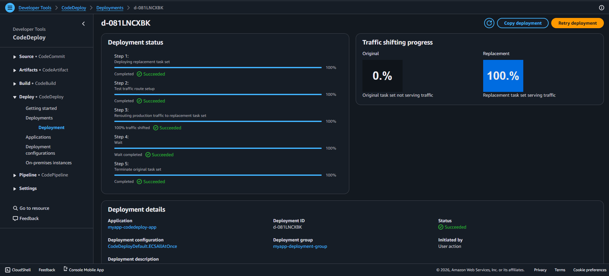

### Role of Each Component During Deployment

**Production Listener (port 80):** Initially forwards to the Blue target group. CodeDeploy modifies this listener to shift production traffic to the Green target group at the traffic rerouting step.

**Test Listener (port 8080):** Forwards to the Green target group from the moment the Green task set is created. Provides a stable endpoint for pre-production validation before the production listener is modified.

**Blue Target Group:** Receives production traffic at the start of the deployment. Continues receiving traffic until CodeDeploy performs the traffic shift. Removed after the termination delay.

**Green Target Group:** Receives test traffic from port 8080 during validation. Receives all production traffic after the shift. Becomes the new Blue after the deployment completes.

**Replacement Task Set (Green):** The new ECS task set running the updated container image. Created by CodeDeploy, registered with the Green target group, and promoted to primary after traffic shifting.

**Traffic Shifting:** The atomic operation in which CodeDeploy modifies the ALB production listener rule to point to the Green target group instead of the Blue.

**Termination Delay:** A configurable wait period after traffic shifting during which the original (Blue) task set remains running. Provides a rollback window without requiring re-deployment.

**Rollback:** If a CloudWatch alarm fires during the deployment (specifically during the deployment window, before the termination delay expires), CodeDeploy reverses the traffic shift, returning the production listener to the Blue target group, and aborts the Green task set.

---

## 10. Deployment Artifacts

Three files are produced by the CodeBuild stage and consumed by the CodeDeploy stage.

### 10.1 imageDetail.json

**Generated by:** `buildspec.yml` post_build phase  
**Purpose:** Tells CodeDeploy exactly which Docker image to deploy. CodeDeploy reads the `ImageURI` value and injects it into `taskdef.json` in place of the `<IMAGE1_NAME>` placeholder before registering the new Task Definition revision.

**Format:**

```json
{
  "ImageURI": "004078028366.dkr.ecr.us-east-1.amazonaws.com/[repo-name]:a3f9c12"
}
```

**Note:** This file is generated at build time and is not committed to the repository. It appears in the `BuildArtifact` ZIP alongside `appspec.yml` and `taskdef.json`.

**Why this format:** CodeDeploy's ECS Blue/Green integration expects `imageDetail.json` with the key `ImageURI` (singular). This is distinct from `imagedefinitions.json`, which uses an array format and is used only with the ECS rolling update (ECS deployment controller) action type, not CodeDeploy. Using `imagedefinitions.json` with a CodeDeploy action will cause an `INVALID_REVISION` error.

### 10.2 appspec.yml

The complete `appspec.yml` as committed to the repository:

```yaml
version: 0.0

Resources:
  - TargetService:
      Type: AWS::ECS::Service
      Properties:
        TaskDefinition: <TASK_DEFINITION>
        LoadBalancerInfo:
          ContainerName: "myapp-container"
          ContainerPort: 3000
```

**Field explanations:**

`version: 0.0`  
The AppSpec version for ECS deployments. For Amazon ECS, this value must be `0.0`. Using any other value (such as `1` or `0.1`) will cause CodeDeploy to reject the file with an invalid AppSpec version error. This is counterintuitive but is the correct value for ECS AppSpec files.

`Resources`  
A list of ECS resources to update. For ECS Blue/Green deployments, exactly one resource of type `AWS::ECS::Service` is specified.

`TargetService`  
A logical name for this resource entry within the AppSpec file.

`Type: AWS::ECS::Service`  
Tells CodeDeploy this deployment target is an ECS service.

`TaskDefinition: <TASK_DEFINITION>`  
A placeholder that CodeDeploy replaces at deploy time with the ARN of the newly registered Task Definition revision. This cannot be a hardcoded ARN because the revision number increments with every deployment. The angle-bracket placeholder syntax is specific to CodeDeploy's ECS deployment behaviour and is documented by AWS.

`ContainerName: "myapp-container"`  
The name of the container within the Task Definition that the ALB should route traffic to. This must exactly match the `name` field in the `containerDefinitions` array in `taskdef.json`. A mismatch will cause the deployment to fail when CodeDeploy attempts to register the target group with the container.

`ContainerPort: 3000`  
The port on which the container accepts traffic. Must match the `containerPort` in the Task Definition port mappings.

### 10.3 taskdef.json

The complete `taskdef.json` as committed to the repository:

```json
{
  "family": "myapp-task",
  "networkMode": "awsvpc",
  "executionRoleArn": "arn:aws:iam::004078028366:role/capstone-ecs-stack-ECSTaskExecutionRole-1ORVgUgrzGIb",
  "containerDefinitions": [
    {
      "name": "myapp-container",
      "image": "<IMAGE1_NAME>",
      "essential": true,
      "portMappings": [
        {
          "containerPort": 3000,
          "hostPort": 3000,
          "protocol": "tcp"
        }
      ],
      "logConfiguration": {
        "logDriver": "awslogs",
        "options": {
          "awslogs-group": "/ecs/myapp-task",
          "awslogs-region": "us-east-1",
          "awslogs-stream-prefix": "ecs",
          "awslogs-create-group": "true"
        }
      }
    }
  ],
  "requiresCompatibilities": ["FARGATE"],
  "cpu": "512",
  "memory": "1024"
}
```

**Field explanations:**

`family: "myapp-task"`  
The Task Definition family name. AWS uses this as the base name for all revisions of this Task Definition. Every time CodeDeploy registers a new revision, it increments the revision number (e.g., `myapp-task:1`, `myapp-task:2`).

`networkMode: "awsvpc"`  
Required for Fargate. Each task gets its own elastic network interface (ENI) and a private IP address within the VPC. This enables fine-grained security group control at the task level.

`executionRoleArn`  
The IAM role that the ECS container agent assumes to perform actions on behalf of the task: pulling the image from ECR and writing logs to CloudWatch. This is not the same as the task role (which grants permissions to application code running inside the container).

`name: "myapp-container"`  
The container name within this Task Definition. This value must match `ContainerName` in `appspec.yml`.

`image: "<IMAGE1_NAME>"`  
A placeholder that CodeDeploy replaces at deploy time with the `ImageURI` value from `imageDetail.json`. The placeholder name `IMAGE1_NAME` is a CodeDeploy convention for single-container ECS deployments. The angle-bracket syntax is required by the CodeDeploy substitution mechanism.

`essential: true`  
If this container exits or crashes, the entire task is stopped. Since there is only one container in this Task Definition, this is always set to `true`.

`containerPort: 3000` / `hostPort: 3000`  
In `awsvpc` mode, `hostPort` must equal `containerPort`. Traffic arriving at the task's ENI on port 3000 is forwarded to the container's port 3000.

`logDriver: "awslogs"`  
Routes container stdout and stderr to Amazon CloudWatch Logs.

`awslogs-group: "/ecs/myapp-task"`  
The CloudWatch Logs log group where container logs are written. One log stream is created per task using the prefix `ecs`.

`awslogs-create-group: "true"`  
Instructs the container agent to automatically create the log group if it does not already exist. Without this, the task will fail to start if the log group has not been manually created.

`requiresCompatibilities: ["FARGATE"]`  
Marks this Task Definition as Fargate-only. This prevents it from being scheduled on EC2 container instances.

`cpu: "512"` / `memory: "1024"`  
Fargate resource allocations. 512 CPU units = 0.5 vCPU. 1024 MB = 1 GB of memory. These are defined at the task level when using Fargate.

### Placeholder Substitution at Deploy Time

CodeDeploy performs two substitutions automatically when it reads the artifacts:

| Placeholder                          | Source                                           | Value                                                             |
| ------------------------------------ | ------------------------------------------------ | ----------------------------------------------------------------- |
| `<IMAGE1_NAME>` in `taskdef.json`    | `ImageURI` field in `imageDetail.json`           | Full ECR URI with commit-hash tag                                 |
| `<TASK_DEFINITION>` in `appspec.yml` | ARN of newly registered Task Definition revision | `arn:aws:ecs:us-east-1:004078028366:task-definition/myapp-task:N` |

These placeholders exist because both values are unknown at the time the files are committed to the repository. The image URI is only known after CodeBuild completes and pushes the image, and the Task Definition revision ARN is only known after CodeDeploy registers it. The placeholder mechanism allows static files to be committed to source control and resolved dynamically at deploy time.

---

## 11. Monitoring and Governance

### Manual Approval

The Manual Approval stage is positioned between the Build and Deploy stages in CodePipeline. It serves as a governance checkpoint. No deployment can proceed to production without a human decision.

When the build stage succeeds, CodePipeline automatically publishes an approval request to the configured SNS topic. The subscriber receives an email notification containing a link to the approval console. The approver reviews the build output in CodeBuild logs and either approves (triggering the deploy stage) or rejects (terminating the pipeline execution with a failed status).

The approval request has a configurable timeout. If no decision is made within the timeout window, the pipeline execution expires and must be re-run.

**Why this matters in production:** Automated pipelines can move very quickly. A manual approval gate ensures that a human reviews what is about to be deployed, catches regressions that automated tests may have missed, and provides an explicit audit trail of who approved each production deployment and when.

### CloudWatch Alarm

A CloudWatch alarm is configured and associated with the CodeDeploy deployment group. If the alarm enters the `ALARM` state during the CodeDeploy deployment window, CodeDeploy automatically triggers a rollback.

- **Alarm name:** `---`
- **Metric namespace:** `---`
- **Metric name:** `---`
- **Threshold:** `---`
- **Evaluation periods:** `---`
- **Period:** `---`
- **Comparison operator:** `---`
- **Associated CodeDeploy deployment group:** `---`

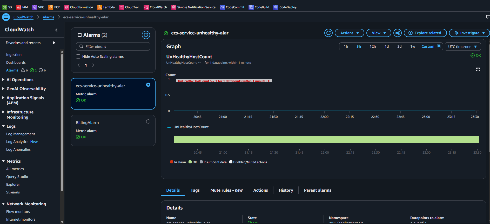

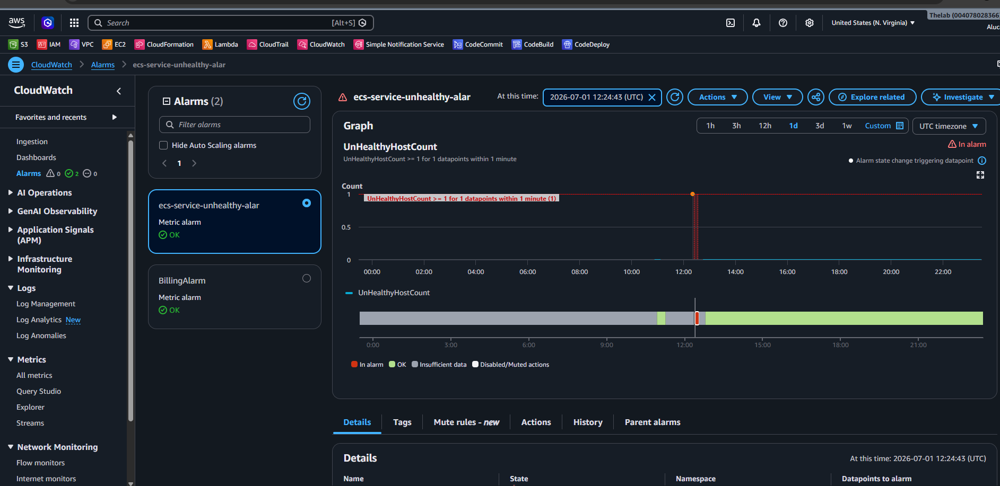

### SNS Topic and Email Notifications

An SNS topic is used for two notification purposes:

1. **Manual approval notifications:** When the pipeline reaches the Approval stage, CodePipeline publishes a message to the SNS topic containing the approval URL, pipeline name, and stage name.
2. **CloudWatch alarm notifications:** The CloudWatch alarm publishes to the same (or a separate) SNS topic when the alarm state changes. An email subscription delivers the alert to the operations team.

- **Topic name:** `---`
- **Topic ARN:** `---`
- **Subscription protocol:** Email
- **Subscriber:** `---`

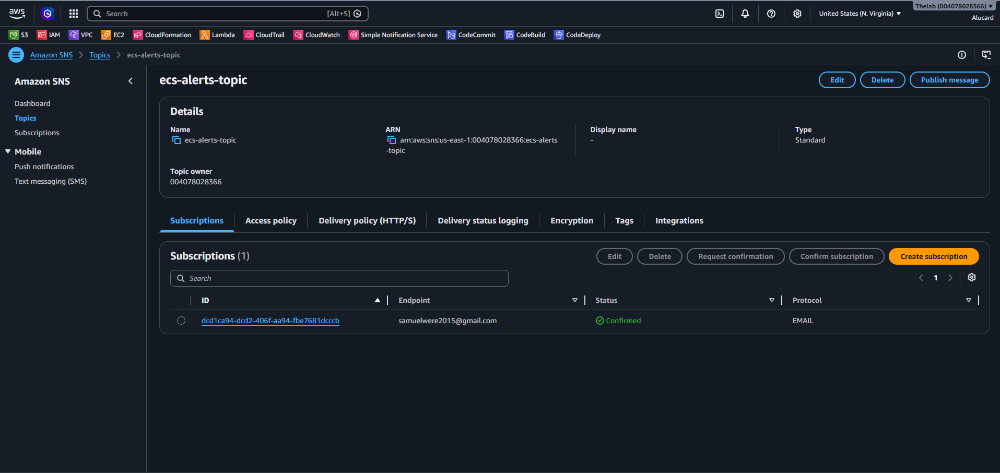

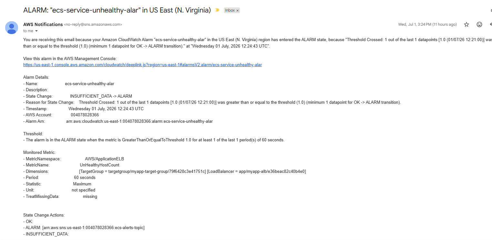

### Automatic Rollback

CodeDeploy is configured to roll back automatically when the associated CloudWatch alarm enters `ALARM` state. The rollback mechanism works as follows:

1. A deployment is in progress (Green task set is live, termination delay has not yet expired).
2. The application health degrades, crossing the CloudWatch alarm threshold.
3. CloudWatch transitions the alarm from `OK` to `ALARM`.
4. CodeDeploy detects the alarm state change.
5. CodeDeploy reverses the ALB production listener to point back to the Blue target group.
6. The Green task set is stopped and removed.
7. The deployment is marked as `Failed` with the reason `CloudWatch alarm triggered rollback`.

**Why this matters in production:** Without automatic rollback, a failing deployment would require a human to detect the problem, diagnose it, and manually intervene. In a real production environment this could mean minutes or hours of degraded service. Automatic rollback reduces the blast radius of a bad deployment to the time between traffic shifting and the CloudWatch alarm evaluation period.

---

## 12. Challenges Encountered

This section documents every significant problem encountered during the implementation of this project. Each subsection describes the problem in full, including the error message observed, the root cause identified, the investigation process, and the resolution applied. These challenges are presented in the approximate order in which they occurred.

---

### 12.1 Creating CodePipeline Before CodeDeploy Existed

**Problem**

The CodePipeline was created with a Deploy stage that referenced a CodeDeploy application and deployment group before either of those resources had been created in AWS.

**Symptoms**

The pipeline failed to save or failed immediately on the first execution with an error indicating that the specified CodeDeploy application or deployment group could not be found.

**Root Cause**

CodePipeline validates the existence of referenced resources when the pipeline is created or when it runs. If the CodeDeploy application and deployment group do not exist at pipeline creation time, the configuration is invalid.

**Investigation**

Reviewed the CodePipeline deploy stage configuration and confirmed that the CodeDeploy application name and deployment group name entered were not present in the CodeDeploy console.

**Solution**

Created the CodeDeploy application and deployment group first, then returned to the CodePipeline deploy stage configuration and entered the correct names. Always create downstream resources (CodeDeploy, ECS Service, Target Groups) before creating the pipeline that references them.

**Lessons Learned**

Infrastructure has dependency ordering requirements. Map out all resource dependencies before beginning creation, and create resources in dependency order: networking and IAM first, then ECS, then CodeDeploy, then the pipeline.

---

### 12.2 Missing CodeDeploy Application

**Problem**

The CodeDeploy application had not been created in the AWS console before configuring the pipeline Deploy stage.

**Symptoms**

The Deploy stage of the pipeline displayed an error indicating it could not locate the specified CodeDeploy application.

**Root Cause**

CodeDeploy applications are the top-level resource that contains deployment groups. No deployment group can exist without first creating the parent application with the correct compute platform (`Amazon ECS`).

**Investigation**

Navigated to the CodeDeploy console and confirmed that no application existed with the name entered in the pipeline configuration.

**Solution**

Created the CodeDeploy application in the console with the compute platform set to `Amazon ECS`. The compute platform must be selected at application creation time and cannot be changed afterward.

**Lessons Learned**

CodeDeploy has a two-level hierarchy: Application > Deployment Group. Both must be created. The compute platform (`EC2/On-premises`, `Lambda`, or `Amazon ECS`) is set at the application level and determines what configuration options are available in the deployment group.

---

### 12.3 Missing Deployment Group

**Problem**

The CodeDeploy application existed but no deployment group had been configured within it.

**Symptoms**

The pipeline Deploy stage failed with an error stating the deployment group could not be found.

**Root Cause**

A CodeDeploy deployment group is where the ECS service, ALB, target groups, listeners, and rollback configuration are all specified. Without a deployment group, CodeDeploy has no information about where or how to deploy.

**Solution**

Created the CodeDeploy deployment group inside the existing application. During configuration, the ECS cluster, ECS service, ALB, production listener, test listener, Blue target group, Green target group, and service role were all specified.

**Lessons Learned**

When creating the deployment group for ECS Blue/Green, the ALB listeners and both target groups must already exist before the deployment group can be configured. If any of those resources are missing, the deployment group creation will fail or be misconfigured.

---

### 12.4 Missing Second Target Group (Green Target Group)

**Problem**

Only one ALB target group had been created. Blue/Green deployment requires two target groups: one for the Blue (original) environment and one for the Green (replacement) environment.

**Symptoms**

The CodeDeploy deployment group configuration page did not show a valid option for the second target group. Attempting to save the deployment group returned an error about the target group configuration being incomplete.

**Root Cause**

CodeDeploy's ECS Blue/Green deployment model requires two separate target groups. It shifts traffic between them by re-associating ALB listener rules. Without a second target group, there is nowhere to direct Green traffic during the deployment.

**Solution**

Created a second ALB target group with identical settings to the first (target type: IP, port 3000, health check on `/health`). Returned to the CodeDeploy deployment group configuration and specified the original target group as Blue and the new one as Green.

**Lessons Learned**

Blue/Green on ECS Fargate with CodeDeploy mandates exactly two target groups per deployment group. Both must be created before the deployment group is configured.

---

### 12.5 Missing ALB Test Listener

**Problem**

The ALB had only one listener configured (port 80). The CodeDeploy deployment group configuration requires a test listener in addition to the production listener.

**Symptoms**

The CodeDeploy deployment group configuration did not accept the configuration without a valid test listener. The deployment group either could not be saved or deployments failed because CodeDeploy could not attach the Green task set to a test listener.

**Root Cause**

CodeDeploy uses the test listener (typically port 8080) to attach the replacement (Green) task set to the ALB before shifting production traffic. Without a test listener, the Green task set cannot be pre-validated through the ALB.

**Solution**

Added a second listener to the ALB on port 8080 with a forward rule to the Green target group. Updated the ALB security group to allow inbound TCP on port 8080. Re-configured the CodeDeploy deployment group to reference this listener as the test listener.

**Lessons Learned**

The test listener is not optional for CodeDeploy ECS Blue/Green deployments. Plan for both port 80 and port 8080 when designing the ALB and security group configurations.

---

### 12.6 IAM Permission Issues: ecs:DescribeServices AccessDenied

**Problem**

The CodeDeploy service role lacked the `ecs:DescribeServices` permission.

**Symptoms**

A deployment was initiated and CodeDeploy immediately failed with an `AccessDenied` error. The error message in the CodeDeploy deployment logs stated that the service role was not authorized to perform `ecs:DescribeServices` on the ECS service.

**Root Cause**

CodeDeploy must describe the existing ECS service to read its current state before creating the replacement task set. If the service role does not have this permission, CodeDeploy cannot proceed.

**Investigation**

Examined the CodeDeploy deployment event log in the AWS console. Identified the exact API call that was denied. Navigated to the IAM console, opened the CodeDeploy service role, and confirmed the missing permission.

**Solution**

Added `ecs:DescribeServices` to the CodeDeploy service role's inline or managed policy, scoped to the target ECS cluster and service ARN.

**Lessons Learned**

CodeDeploy for ECS requires a broad set of ECS, ALB, and IAM permissions. Rather than adding permissions reactively one at a time, consult the AWS documentation for the full required permission set for the `AWSCodeDeployRoleForECS` managed policy and attach it or replicate its permissions.

---

### 12.7 ECS Service Using ECS Deployment Controller Instead of CODE_DEPLOY

**Problem**

The ECS service was created with the default deployment controller (`ECS`, the rolling update controller) instead of `CODE_DEPLOY`.

**Symptoms**

CodeDeploy could not manage the ECS service. Deployments either failed immediately or CodeDeploy reported that the service was not configured for Blue/Green deployments. The ECS service might have deployed using the rolling update strategy, bypassing CodeDeploy entirely.

**Root Cause**

The ECS deployment controller is set at service creation time and cannot be changed on an existing service. An ECS service with the `ECS` controller cannot be converted to the `CODE_DEPLOY` controller without deleting and recreating the service.

**Investigation**

Navigated to the ECS console, opened the service's configuration, and found the deployment controller was set to `ECS` (rolling update). Confirmed in the AWS documentation that this field is immutable after service creation.

**Solution**

The ECS service had to be deleted and recreated with `CODE_DEPLOY` as the deployment controller. During recreation, the service was configured with the correct ALB integration (production listener on port 80, Blue target group), subnets, and security group.

**Lessons Learned**

The ECS service deployment controller is one of the most important configuration decisions and is permanent. For any pipeline that uses CodeDeploy, always select `CODE_DEPLOY` at service creation. If the wrong controller is selected, the only recourse is deletion and recreation.

---

### 12.8 Deleting the ECS Service Removing Associated Networking Resources

**Problem**

Deleting the ECS service during the recreation process also removed associated networking and ALB resources that had been manually created.

**Symptoms**

After deleting the ECS service, the ALB target group registrations were cleared, and some listener rules were removed. Resources that were expected to still exist were gone or in a degraded state.

**Root Cause**

ECS services with ALB integration can hold references to listener rules and target group associations. When a service is deleted, it may deregister its tasks from target groups and clean up listener rules depending on how the integration was configured.

**Investigation**

After deleting the service and attempting to recreate it, errors appeared about missing target groups and listeners. Cross-referenced the ALB console with what existed before the service deletion.

**Solution**

Recreated the affected resources: target groups, listeners, and security group rules where necessary. Proceeded with creating the new ECS service from scratch with `CODE_DEPLOY` selected.

**Lessons Learned**

Before deleting an ECS service, audit all associated ALB resources and note their exact configuration. Plan to recreate them if the service deletion affects them. In production, this type of operation should be performed with a runbook and a maintenance window.

---

### 12.9 Missing Security Group After Service Recreation

**Problem**

During service recreation, the correct security group for the ECS tasks was either missing or not specified, causing tasks to fail to communicate with the ALB.

**Symptoms**

New ECS tasks would start but the ALB health checks would fail. The target group showed targets in an `unhealthy` state.

**Root Cause**

The ECS task security group must allow inbound traffic on port 3000 from the ALB security group. If the task security group was incorrect, recreated with missing rules, or not specified during service creation, the ALB cannot reach the containers.

**Solution**

Verified the ECS task security group configuration, confirmed the inbound rule for TCP port 3000 from the ALB security group was present, and re-created the ECS service with the correct security group specified.

**Lessons Learned**

ALB-to-container connectivity depends on the security group configuration being correct in both directions: ALB security group must allow outbound to the ECS task security group, and the ECS task security group must allow inbound from the ALB security group on the container port.

---

### 12.10 TargetGroupNotFound Errors

**Problem**

After target groups were deleted and recreated, CodeDeploy or the ECS service configuration still referenced the old target group ARNs.

**Symptoms**

`TargetGroupNotFound` errors appeared in the CodeDeploy deployment events or the ECS service event log when attempting to initiate a deployment.

**Root Cause**

Target groups have ARNs that include a unique hash. Deleting and recreating a target group with the same name produces a new ARN. Any resource (CodeDeploy deployment group, ECS service) that was configured with the old ARN must be updated.

**Solution**

After recreating the target groups, updated the CodeDeploy deployment group configuration to reference the new target group ARNs. Updated any ECS service listener associations. Verified that both the Blue and Green target group ARNs in the deployment group matched the current ARNs in the ALB console.

**Lessons Learned**

AWS resource ARNs are unique and immutable per resource lifecycle. Deleting and recreating a resource produces a new ARN. All dependent configurations must be updated to use the new ARN.

---

### 12.11 Git Bash Converting /health into a Windows File Path

**Problem**

When running AWS CLI commands from Git Bash on Windows, path arguments beginning with a forward slash were being converted to Windows file system paths.

**Symptoms**

An AWS CLI command containing a path like `/health` was being interpreted by the shell as `C:/Program Files/Git/health` because Git Bash's MSYS layer performs automatic POSIX-to-Windows path conversion on arguments that look like absolute paths.

**Example command exhibiting the problem:**

```bash
aws elbv2 create-target-group --health-check-path /health ...
```

**Git Bash converted this to:**

```bash
aws elbv2 create-target-group --health-check-path C:/Program Files/Git/health ...
```

**Root Cause**

MSYS2 (used by Git Bash on Windows) automatically converts arguments that begin with `/` into Windows paths. This is useful for many commands but breaks AWS CLI arguments that use Unix-style paths as literal string values.

**Investigation**

The AWS CLI returned an error about an invalid health check path. Printing the argument directly confirmed that the path had been modified by the shell before being passed to the CLI.

**Solution**

Set the environment variable `MSYS_NO_PATHCONV=1` before running the AWS CLI command. This disables MSYS2's automatic path conversion for the duration of that shell session or command.

```bash
MSYS_NO_PATHCONV=1 aws elbv2 create-target-group --health-check-path /health ...
```

Alternatively, the variable can be exported to apply to all subsequent commands:

```bash
export MSYS_NO_PATHCONV=1
```

**Lessons Learned**

AWS CLI commands that include path strings (health check paths, S3 prefixes, API Gateway resource paths) are affected by MSYS2 path conversion in Git Bash on Windows. Always set `MSYS_NO_PATHCONV=1` when running such commands from Git Bash. PowerShell or Windows Command Prompt do not have this issue.

---

### 12.12 Recreating Target Groups, Listeners, Security Groups, and the ECS Service

**Problem**

After the series of deletions and misconfigurations described in the preceding sections, it became necessary to rebuild the networking and ECS layer from scratch in the correct order.

**Symptoms**

Multiple interdependent resources were in inconsistent states. The ECS service had the wrong deployment controller, target group ARNs were stale, listeners were missing, and the security group rules were incorrect.

**Resolution Sequence**

The recreation was performed in the following order to respect dependency requirements:

1. Verified and cleaned up security groups, ensuring the ALB and ECS task security groups had the correct inbound and outbound rules.
2. Recreated both ALB target groups (Blue and Green) with the correct target type (`ip`), port (`3000`), and health check path (`/health`).
3. Updated the ALB listeners: production listener on port 80 forwarding to the Blue target group, test listener on port 8080 forwarding to the Green target group.
4. Deleted the incorrectly configured ECS service.
5. Recreated the ECS service with `CODE_DEPLOY` as the deployment controller, specifying the correct subnets, security group, Task Definition, and ALB integration.
6. Updated the CodeDeploy deployment group to reference the new target group ARNs and the recreated ECS service.
7. Triggered a new pipeline execution to validate the complete setup.

**Lessons Learned**

When multiple resources are interdependent and in inconsistent states, attempting to fix them one at a time often creates new inconsistencies. It is more effective to document the current state, identify the correct final state, and recreate resources in strict dependency order.

---

### 12.13 Missing AppSpec File: INVALID_REVISION Errors

**Problem**

The CodeDeploy deploy stage failed with an `INVALID_REVISION` error.

**Symptoms**

In the CodeDeploy deployment event log, the deployment was immediately marked as failed with the message `INVALID_REVISION`. No tasks were created and no traffic shifting occurred.

**Root Cause — Investigated**

Several possible causes were investigated:

1. The `BuildArtifact` did not contain `appspec.yml`. This happens if the `artifacts` section of `buildspec.yml` does not list `appspec.yml`, or if the file was not present in the repository at the time of the build.
2. The `appspec.yml` file had an incorrect version number. ECS AppSpec files must use `version: 0.0`. Any other value causes CodeDeploy to reject the file.
3. The `imageDetail.json` filename was incorrect. CodeDeploy expects exactly `imageDetail.json` (with a capital `D`). Using `imagedefinitions.json` or any other filename causes the deployment to fail.
4. The artifact configuration in the CodeDeploy deploy action did not correctly reference the `BuildArtifact` from the CodeBuild stage.

**Solution**

Verified that:

- `appspec.yml` was present in the repository root.
- `appspec.yml` was listed in the `artifacts.files` section of `buildspec.yml`.
- The version in `appspec.yml` was `0.0` (not `1` or any other value).
- The `imageDetail.json` filename and format were exactly correct.
- The CodeDeploy action in the pipeline was configured to use `BuildArtifact` as its input artifact.

After confirming all of the above, re-triggered the pipeline and the deployment succeeded.

**Lessons Learned**

`INVALID_REVISION` is a generic CodeDeploy error that can indicate any of several problems with the deployment artifacts. Debug it systematically: check that all required files are present in the artifact, verify the exact filenames and version values, and confirm the artifact wiring in the pipeline.

---

### 12.14 Invalid AppSpec Version

**Problem**

The initial `appspec.yml` was written with a version value that CodeDeploy rejected.

**Symptoms**

CodeDeploy deployment failed with an error referencing the AppSpec version being invalid or unsupported.

**Root Cause**

AWS CodeDeploy for ECS requires `version: 0.0` in the AppSpec file. This is not intuitive; most configuration files use incrementing version numbers where newer versions have higher numbers. The `0.0` value is specific to ECS deployments and is a documented AWS requirement.

**Solution**

Changed the `version` field in `appspec.yml` from the incorrect value to `0.0`.

**Lessons Learned**

Always verify the exact required AppSpec version for the deployment target type (EC2, Lambda, ECS) in the AWS documentation. Do not assume versioning conventions from other file formats apply here.

---

### 12.15 Understanding IMAGE1_NAME and TASK_DEFINITION Placeholders

**Problem**

The purpose and exact syntax of the `<IMAGE1_NAME>` and `<TASK_DEFINITION>` placeholders was unclear during initial configuration.

**Symptoms**

Attempts were made to hardcode actual values (ECR URIs, Task Definition ARNs) into the files, which either broke the deployment or caused the pipeline to always deploy the same image regardless of what was built.

**Root Cause**

These placeholders are a CodeDeploy-specific substitution mechanism. CodeDeploy reads `imageDetail.json` to get the current image URI, then scans `taskdef.json` for the literal string `<IMAGE1_NAME>` and replaces it. Similarly, after registering the new Task Definition revision, CodeDeploy scans `appspec.yml` for `<TASK_DEFINITION>` and replaces it with the new revision ARN.

**Solution**

Used the exact placeholder strings (`<IMAGE1_NAME>` and `<TASK_DEFINITION>`) as documented by AWS without modification. These placeholders are case-sensitive and must include the angle brackets.

**Lessons Learned**

The placeholder mechanism is what makes the deployment artifacts dynamic. Without it, the Task Definition would always deploy the same image and the AppSpec would always reference the same (potentially outdated) Task Definition revision. Understanding this mechanism is fundamental to understanding how CodeDeploy's ECS integration works.

---

### 12.16 Difference Between imagedefinitions.json and imageDetail.json

**Problem**

The wrong artifact file format was used for the CodeDeploy deploy action.

**Symptoms**

The CodeDeploy deployment failed to identify the correct image to deploy, or the deployment failed entirely with an `INVALID_REVISION` or missing image error.

**Root Cause**

There are two different image artifact formats used by AWS ECS deployment actions, and they are not interchangeable:

| File                    | Used by               | Format                                         | Deploy action type   |
| ----------------------- | --------------------- | ---------------------------------------------- | -------------------- |
| `imagedefinitions.json` | ECS rolling update    | `[{"name":"container-name","imageUri":"..."}]` | ECS (rolling update) |
| `imageDetail.json`      | CodeDeploy Blue/Green | `{"ImageURI":"..."}`                           | AWS CodeDeploy       |

Using `imagedefinitions.json` with a CodeDeploy deploy action or vice versa will cause the deployment to fail.

**Solution**

Changed the `buildspec.yml` post_build phase to generate `imageDetail.json` (not `imagedefinitions.json`) with the format `{"ImageURI":"..."}`. Updated the `artifacts.files` list in `buildspec.yml` to include `imageDetail.json`.

**Lessons Learned**

The two file formats serve different pipeline architectures. If the pipeline uses CodeDeploy for Blue/Green ECS deployments, the artifact must be `imageDetail.json`. If it uses the ECS rolling update deploy action directly from CodePipeline, it must be `imagedefinitions.json`. Using the wrong file format silently produces incorrect deployments or outright failures.

---

### 12.17 IAM Permission Issues: ecs:RegisterTaskDefinition

**Problem**

CodeDeploy could not register a new revision of the ECS Task Definition because the CodeDeploy service role lacked the `ecs:RegisterTaskDefinition` permission.

**Symptoms**

The CodeDeploy deployment event log showed an `AccessDenied` error when attempting to register the Task Definition. The deployment failed at the "Register task definition" step.

**Solution**

Added `ecs:RegisterTaskDefinition` to the CodeDeploy service role's IAM policy, scoped appropriately.

**Lessons Learned**

CodeDeploy registers a new Task Definition revision on every ECS Blue/Green deployment. The service role must have this permission. It is part of the `AWSCodeDeployRoleForECS` managed policy.

---

### 12.18 IAM Permission Issues: iam:PassRole

**Problem**

CodeDeploy could not pass the ECS Task Execution Role to the newly registered Task Definition because the CodeDeploy service role lacked `iam:PassRole`.

**Symptoms**

The deployment failed with an error stating that the principal (CodeDeploy service role) was not authorized to perform `iam:PassRole` on the ECS Task Execution Role.

**Root Cause**

When CodeDeploy registers a new Task Definition revision, it must pass the Task Execution Role ARN to the ECS service. AWS enforces that any entity that passes an IAM role to another service must have explicit `iam:PassRole` permission on that role.

**Solution**

Added `iam:PassRole` to the CodeDeploy service role's policy, scoped to the ECS Task Execution Role ARN (`arn:aws:iam::004078028366:role/capstone-ecs-stack-ECSTaskExecutionRole-1ORVgUgrzGIb`).

**Lessons Learned**

`iam:PassRole` is a commonly overlooked permission. Any service that registers or creates resources specifying an IAM role must have `iam:PassRole` on that specific role. Scope it tightly to the exact role ARN rather than using a wildcard.

---

### 12.19 IAM Permission Issues: CodeDeploy APIs

**Problem**

Various other IAM permission gaps in the CodePipeline service role, CodeBuild service role, and CodeDeploy service role were discovered during pipeline execution.

**Symptoms**

Different stages of the pipeline failed with `AccessDenied` errors for various API calls including ALB describe operations, ECS create operations, and S3 artifact operations.

**Solution**

Iteratively added missing permissions to the appropriate service roles after each failure. Reviewed the AWS documentation for the minimum required permissions for each service role type. The following permissions were found to be necessary across the various service roles:

- CodePipeline role: `codedeploy:CreateDeployment`, `codedeploy:GetDeployment`, `codedeploy:GetDeploymentConfig`, `codedeploy:RegisterApplicationRevision`, `s3:GetObject`, `s3:PutObject`, `codebuild:StartBuild`, `codebuild:BatchGetBuilds`, `sns:Publish`.
- CodeBuild role: `ecr:GetAuthorizationToken`, ECR image push permissions, `s3:GetObject`, `s3:PutObject`, `logs:CreateLogGroup`, `logs:CreateLogStream`, `logs:PutLogEvents`.
- CodeDeploy role: `ecs:DescribeServices`, `ecs:CreateTaskSet`, `ecs:UpdateServicePrimaryTaskSet`, `ecs:DeleteTaskSet`, `ecs:RegisterTaskDefinition`, `iam:PassRole`, `elasticloadbalancing:DescribeTargetGroups`, `elasticloadbalancing:ModifyListener`, `elasticloadbalancing:DescribeListeners`, `elasticloadbalancing:DescribeRules`.

**Lessons Learned**

IAM permission issues are the most common source of failures when first configuring AWS service integrations. Use AWS-managed policies as a starting point where they exist (such as `AWSCodeDeployRoleForECS`), and supplement with specific permissions as needed. Review CloudTrail alongside service-specific event logs to identify the exact denied API calls.

---

### 12.20 Successful Blue/Green Deployment

After resolving all the preceding issues, the first successful end-to-end Blue/Green deployment was achieved. The complete flow executed as follows:

1. Code was pushed to the GitHub repository.
2. CodePipeline triggered automatically.
3. The Source stage pulled the repository content.
4. The Build stage executed `buildspec.yml`: dependencies were installed, all three Jest tests passed, the Docker image was built and pushed to ECR with both the commit-hash tag and `latest`, and `imageDetail.json` was generated.
5. The pipeline paused at the Manual Approval stage and the SNS notification was delivered.
6. The deployment was approved in the CodePipeline console.
7. CodeDeploy registered a new Task Definition revision, created the Green task set, waited for health checks to pass, shifted production traffic from the Blue to the Green target group, waited for the termination delay, and removed the original Blue task set.
8. The pipeline execution completed with a `Succeeded` status.

---

### 12.21 Manual Approval Integration

The SNS notification for the Manual Approval stage was tested and confirmed to deliver email notifications correctly. The approval action in the pipeline console functioned as expected, allowing the reviewer to approve or reject with an optional comment.

---

### 12.22 CloudWatch Monitoring and SNS Alerts

After completing the base deployment, CloudWatch alarms and SNS alerting were configured and tested. The alarm was configured against an appropriate metric and associated with the CodeDeploy deployment group.

---

### 12.23 Automatic Rollback Testing: Intentional Application Failure

To validate the automatic rollback mechanism, an intentional failure was introduced into the application.

**Method**

The `/health` endpoint in `src/app.js` was temporarily modified to return an HTTP 500 status code instead of the normal HTTP 200 response. This caused the ALB target group health checks to fail for every task in the Green task set.

**What Was Observed**

1. The modified code was pushed to the GitHub repository.
2. The pipeline triggered, the build passed (note: see subsection 12.24 about the test suite adjustment).
3. CodeDeploy created the Green task set and attempted to register it with the Green target group.
4. The ALB health checks against `/health` returned HTTP 500.
5. The Green tasks were marked unhealthy.
6. The CloudWatch alarm entered `ALARM` state.
7. CodeDeploy rolled back the deployment, restoring the production listener to the Blue target group.
8. The pipeline Deploy stage was marked as failed.
9. The SNS topic delivered an alarm notification email.

After confirming the rollback behaviour, the `/health` endpoint was restored to return HTTP 200 and the pipeline was re-run to return the service to its healthy state.

---

### 12.24 Temporarily Disabling npm test to Allow Deployment Testing

**Problem**

During rollback testing, the intentional failure introduced into `app.js` (the `/health` endpoint returning HTTP 500) also caused the Jest test suite to fail in CodeBuild, because `tests/app.test.js` asserts that `GET /health` returns HTTP 200. This meant the pipeline was stopping at the Build stage rather than reaching the Deploy stage where the rollback could be observed.

**Symptoms**

The Build stage failed with Jest test failures before the Docker image was built or pushed. The Deploy stage was never reached, so the rollback behaviour could not be observed.

**Solution**

The `npm test` command was temporarily commented out or skipped in `buildspec.yml` so that the build stage would complete successfully with the deliberately broken application, allowing the broken image to reach the Deploy stage and trigger the rollback.

After observing and documenting the rollback behaviour, `npm test` was restored in `buildspec.yml` and the health endpoint was fixed.

**Lessons Learned**

A well-designed CI pipeline that includes unit tests will catch intentional failures before they reach the deployment stage. This is desirable in normal operation but complicates deliberate failure scenario testing. In a real production environment, rollback testing is typically performed in a lower environment (staging) without disabling tests, or failure scenarios are introduced in ways that pass unit tests but fail integration checks.

---

## 13. Testing

### 13.1 Application Unit Testing

The Jest test suite in `tests/app.test.js` validates all three application endpoints using Supertest for HTTP-level assertions.

**Test 1: Landing page**

- Request: `GET /`
- Expected: HTTP 200, response body contains "AWS CI/CD Capstone Project"
- Result: Pass

**Test 2: Health check endpoint**

- Request: `GET /health`
- Expected: HTTP 200, JSON body `{"status":"OK","message":"Application is healthy"}`
- Result: Pass

**Test 3: Unknown route**

- Request: `GET /unknown`
- Expected: HTTP 404, JSON body `{"status":"error","message":"Route not found"}`
- Result: Pass

Tests are executed in the CodeBuild build phase with `npm test`, which runs `jest --runInBand`. The `--runInBand` flag ensures tests run serially, suitable for the CodeBuild environment. A failing test stops the build and prevents a broken image from being pushed to ECR.

### 13.2 Container Testing

The Docker image was tested locally before being integrated into the pipeline:

- The image was built with `docker build`.
- The container was run with `docker run -p 3000:3000`.
- All three endpoints were verified by sending HTTP requests to `localhost:3000`.
- The container start time, response content, and HTTP status codes were confirmed

### 13.3 Pipeline Testing

The complete pipeline was triggered multiple times to validate each stage:

- Pushes to the main branch confirmed automatic pipeline triggering.
- CodeBuild logs confirmed dependency installation, test execution, Docker build, and push.
- The `BuildArtifact` was downloaded from S3 and inspected to confirm all three files were present with correct content.
- The Manual Approval email notification was confirmed to be received.
- The Approval action in the console was used to approve a deployment.

### 13.4 Blue/Green Deployment Testing

After the first successful deployment, the deployment behaviour was tested by making changes to the application source and pushing them to GitHub.

**Test approach:**

1. Modified the landing page HTML in `app.js` to include a version indicator (the application title progressed through versions during development, visible in the source as "Project-V3").
2. Pushed the change.
3. Observed the pipeline trigger.
4. After approval, observed the CodeDeploy deployment create the Green task set.
5. Accessed the application via the test listener (port 8080) to confirm the new version was running.
6. Approved traffic shifting in the CodeDeploy console (or waited for automatic shifting).
7. Confirmed the production endpoint (port 80) served the new version.
8. Confirmed the Blue task set was terminated after the delay.

### 13.5 Failure Simulation and Rollback Testing

As described in section 12.23, the `/health` endpoint was temporarily modified to return HTTP 500 to trigger an automatic rollback.

**Expected results:**

- ALB health checks fail for Green tasks.
- CloudWatch alarm enters `ALARM` state.
- CodeDeploy rolls back to Blue.
- SNS delivers an alarm email.
- The production endpoint continues serving the stable Blue version throughout.

**Observed results:** All expected behaviours were confirmed.

### 13.6 Monitoring and Alarm Testing

The CloudWatch alarm was tested in both normal and alarm states:

- In normal operation: alarm state is `OK`, no notifications are sent.
- During rollback test: alarm transitioned to `ALARM`, SNS notification was delivered, CodeDeploy rolled back.
- After health endpoint was restored: alarm transitioned back to `OK`.

### 13.7 Manual Approval Testing

The Manual Approval stage was tested in both the approval and rejection paths:

- **Approval path:** The approve action was clicked in the pipeline console. The pipeline proceeded to the Deploy stage.
- **Rejection path:** The reject action was clicked with a comment. The pipeline execution was marked as failed with the rejection comment visible in the execution history.

---

## 14. Lessons Learned

### AWS Networking

Networking is the foundation that everything else depends on. VPC, subnet, security group, and target group configurations must be correct before any other service can function. Security group rules must be planned bidirectionally: inbound on the target, outbound from the source. In a Fargate/ALB architecture, the critical rule is: ALB security group must allow inbound from the internet on the listener ports, and ECS task security group must allow inbound from the ALB security group on the container port.

### IAM

IAM is the second most common source of failures in AWS service integrations. Service roles must be created with appropriate trust policies (specifying which AWS service can assume the role) and the correct permission policies. For pipelines involving multiple services, each service has its own role with its own permission requirements. The `iam:PassRole` permission is a frequently overlooked requirement when one service creates resources that reference IAM roles.

### Blue/Green Deployments

Blue/Green deployment on ECS via CodeDeploy has many pre-conditions: the `CODE_DEPLOY` deployment controller must be set at ECS service creation, two target groups are required, two ALB listeners are required, and the CodeDeploy application and deployment group must exist with correct configuration before the pipeline is created. The deployment controller type is immutable, making it the single most critical configuration decision at service creation time.

### CodeDeploy

CodeDeploy's ECS integration is powerful but requires precise artifact formats, exact placeholder strings, and the correct AppSpec version (`0.0` for ECS). The distinction between `imagedefinitions.json` (rolling update) and `imageDetail.json` (Blue/Green via CodeDeploy) is a detail that is easy to get wrong but causes immediate deployment failures.

### CodePipeline

Pipeline stages must reference resources that actually exist. Always create downstream resources (ECS service, CodeDeploy application and deployment group, target groups, ALB listeners) before creating the pipeline that references them. When a pipeline stage fails, the error message in the stage detail view and the service-specific event log (CodeBuild logs, CodeDeploy event log) should be read together to diagnose the root cause.

### Debugging AWS Errors

AWS error messages are often generic (`INVALID_REVISION`, `AccessDenied`) and the actual cause requires investigation through multiple consoles: the pipeline stage detail, CloudWatch Logs for CodeBuild, the CodeDeploy deployment event timeline, and CloudTrail for IAM-related failures. Developing a systematic debug approach — check the event log, identify the specific failing API call, look up the required permission, update the role, re-trigger — is essential.

### CloudWatch

CloudWatch Alarms and CodeDeploy rollback integration provide a critical safety net. However, the alarm must be tuned correctly: an alarm that triggers too eagerly will roll back valid deployments; an alarm that is too permissive will not catch real failures. The CloudWatch alarm evaluation period must be short enough to catch problems during the CodeDeploy deployment window.

### Infrastructure Dependencies

AWS resources have complex dependency graphs. The order in which resources are created matters. Security groups must exist before ECS services, target groups must exist before listeners, listeners must exist before the CodeDeploy deployment group, and the deployment group must exist before the pipeline. Violating this order results in configuration failures that can cascade.

### CI/CD Design

The pipeline design reflects real-world production practices: automated testing as a gate, human approval before production, Blue/Green for zero-downtime deployment, health check monitoring for automatic rollback. Each of these elements exists to reduce risk at a different point in the deployment lifecycle. The value of CI/CD is not just automation; it is reproducibility and the enforcement of quality gates.

### DevOps Practices

Debugging a complex, multi-service architecture requires methodical isolation of each component. When a deployment fails, the question is not "what is wrong" but "which layer is wrong": source, build, artifact, IAM, networking, or application. Treating each layer as independently debuggable and verifiable is the most efficient approach. Documentation of failures and their resolutions (as in this README) accelerates resolution of similar issues in the future.

---

## 15. Future Improvements

The following enhancements would increase the production-readiness, security, and operational quality of this pipeline.

### HTTPS with AWS Certificate Manager (ACM)

The current ALB listener operates on HTTP (port 80). A production system should use HTTPS. This would involve requesting an SSL/TLS certificate through ACM, adding an HTTPS listener on port 443, redirecting HTTP to HTTPS, and updating the CodeDeploy test listener to operate on a different port over HTTPS.

### Route 53 DNS

The application is currently accessed via the ALB's auto-generated DNS name. Configuring a Route 53 hosted zone with an Alias record pointing to the ALB DNS name would provide a human-readable, stable domain name for the application.

### Infrastructure as Code

All infrastructure in this project was created manually through the AWS console and CLI. Converting the complete infrastructure to AWS CloudFormation or Terraform would make the setup reproducible, version-controlled, peer-reviewable, and deployable to multiple environments with environment-specific parameters.

### Multiple Environments

The current pipeline deploys to a single environment. A production system would have at minimum two environments (staging and production) with promotion gates between them. The pipeline would deploy to staging first, run integration tests, require approval, and then deploy to production.

### AWS Secrets Manager

Currently, environment-specific configuration is passed via environment variables in the CodeBuild project and Task Definition. Sensitive values (API keys, database credentials) should be stored in AWS Secrets Manager and injected into containers at runtime using the ECS secrets integration, keeping them out of task definitions and source control.

### ECS Service Auto Scaling

The ECS service currently runs a fixed number of tasks. Configuring Application Auto Scaling on the ECS service with CloudWatch metric-based scaling policies would allow the service to scale in and out based on CPU utilisation, memory utilisation, or ALB request count.

### Code Coverage and Static Analysis

The current test suite has three tests covering the primary endpoints. Adding code coverage reporting (via Jest's `--coverage` flag), minimum coverage thresholds (failing the build if coverage drops below a threshold), and static analysis tools (such as ESLint) would increase confidence in the codebase quality.

### Integration Tests in the Pipeline

The current test stage only runs unit tests. Adding a post-deployment integration test stage that runs against the test listener (port 8080) before traffic is shifted to production would catch integration-level failures that unit tests cannot.

---

## 16. References

The following official AWS documentation was referenced during the implementation of this project.

| Service                         | Documentation                                                                                           |
| ------------------------------- | ------------------------------------------------------------------------------------------------------- |
| Amazon ECS                      | https://docs.aws.amazon.com/AmazonECS/latest/developerguide/                                            |
| AWS Fargate                     | https://docs.aws.amazon.com/AmazonECS/latest/userguide/what-is-fargate.html                             |
| Amazon ECR                      | https://docs.aws.amazon.com/AmazonECR/latest/userguide/                                                 |
| AWS CodePipeline                | https://docs.aws.amazon.com/codepipeline/latest/userguide/                                              |
| AWS CodeBuild                   | https://docs.aws.amazon.com/codebuild/latest/userguide/                                                 |
| AWS CodeDeploy                  | https://docs.aws.amazon.com/codedeploy/latest/userguide/                                                |
| CodeDeploy AppSpec for ECS      | https://docs.aws.amazon.com/codedeploy/latest/userguide/reference-appspec-file-structure-resources.html |
| CodeDeploy Blue/Green ECS       | https://docs.aws.amazon.com/codedeploy/latest/userguide/deployment-steps-ecs.html                       |
| ECS Task Definitions            | https://docs.aws.amazon.com/AmazonECS/latest/developerguide/task_definitions.html                       |
| Application Load Balancer       | https://docs.aws.amazon.com/elasticloadbalancing/latest/application/                                    |
| ALB Target Groups               | https://docs.aws.amazon.com/elasticloadbalancing/latest/application/load-balancer-target-groups.html    |
| Amazon CloudWatch Alarms        | https://docs.aws.amazon.com/AmazonCloudWatch/latest/monitoring/AlarmThatSendsEmail.html                 |
| Amazon SNS                      | https://docs.aws.amazon.com/sns/latest/dg/                                                              |
| AWS IAM                         | https://docs.aws.amazon.com/IAM/latest/UserGuide/                                                       |
| iam:PassRole                    | https://docs.aws.amazon.com/IAM/latest/UserGuide/id_roles_use_passrole.html                             |
| CodeDeploy IAM Roles for ECS    | https://docs.aws.amazon.com/codedeploy/latest/userguide/getting-started-create-service-role.html        |
| buildspec.yml Reference         | https://docs.aws.amazon.com/codebuild/latest/userguide/build-spec-ref.html                              |
| CodePipeline Action Types       | https://docs.aws.amazon.com/codepipeline/latest/userguide/reference-pipeline-structure.html             |
| ECS Deployment Controller Types | https://docs.aws.amazon.com/AmazonECS/latest/APIReference/API_DeploymentController.html                 |
| imageDetail.json Reference      | https://docs.aws.amazon.com/codepipeline/latest/userguide/file-reference.html                           |
| MSYS_NO_PATHCONV (Git Bash)     | https://github.com/git-for-windows/build-extra/blob/HEAD/ReleaseNotes.md                                |
